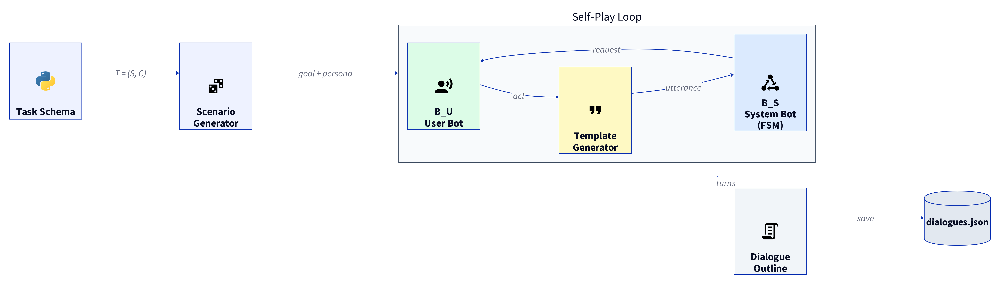

# M2M Self-Play: Medical Domain Implementation

Implementation of **"Building a Conversational Agent Overnight with Dialogue Self-Play"**
Shah et al., Google AI, 2018 ([arXiv:1801.04871](https://arxiv.org/abs/1801.04871))



---

## What the paper proposes

M2M (Machines Talking to Machines) is a framework for automatically generating dialogue training datasets. Instead of paying humans to have conversations from scratch (Wizard-of-Oz), two rule-based bots talk to each other and produce skeleton dialogues called **outlines**. Crowd workers then paraphrase those outlines into natural language.

The framework has two phases:

- **Phase 1, Self-play (automated):** A user bot (B_U) and a system bot (B_S) exchange dialogue acts and generate template-utterance outlines.
- **Phase 2, Paraphrasing (crowdsourced):** Human annotators rewrite each template utterance into natural language while preserving meaning. *(Not implemented here; it is a human task.)*

This implementation covers **Phase 1 only**, which is the full algorithmic contribution of the paper.

---

## What this implementation does

We apply the M2M framework to a **Bangladeshi medical appointment** domain instead of the paper's restaurant/movie domains. The mechanics are identical; only the task schema changes.

A patient bot works through a list of symptoms and concerns. A health assistant bot collects the required information and routes to the correct specialist. Together they generate synthetic dialogue outlines that could serve as training data for systems like AIMSTalk.

---

## Domain & data sources

Slot values are drawn from real Bangladeshi medical NLP datasets:

| Data | Source |
|---|---|
| Symptoms, body parts | Bengali Medical Named Entity Recognition dataset, [Kaggle](https://www.kaggle.com/datasets/shashwatwork/bengali-medical-dataset) (CC BY 4.0) |
| Specialist routing | Specialist Classification dataset, same source |
| Disease/condition names | Assorted Medicine Dataset of Bangladesh, [Kaggle](https://www.kaggle.com/datasets/ahmedshahriarsakib/assorted-medicine-dataset-of-bangladesh) (CC0) |

---

## How to run

```bash
python run.py --n 5
```

Generates 5 dialogue outlines, prints them to the terminal, and saves them to `output/dialogues.json`.

No dependencies; pure Python stdlib.

---

## Output format

Each dialogue follows the format of Table 5 in the paper, with annotation and template utterance shown side by side:

```
--- Dialogue 1 ---
[U] inform(symptom=জ্বর)              | "আমার জ্বর।"
[S] request(duration)                 | "কতদিন ধরে এই সমস্যা?"
[U] inform(duration=৩ দিন)            | "৩ দিন ধরে।"
[S] request(severity)                 | "সমস্যাটা কতটা গুরুতর?"
[U] inform(severity=moderate)         | "মাঝারি মাত্রার।"
[S] confirm(symptom=জ্বর, ...)        | "আপনার জ্বর ৩ দিন ধরে, মাঝারি মাত্রার। ঠিক আছে?"
[U] affirm()                          | "হ্যাঁ।"
[S] notify_success(specialist=Medicine)| "আপনাকে Medicine বিশেষজ্ঞের কাছে পাঠানো হচ্ছে।"
[U] thank_you()                       | "ধন্যবাদ।"
[S] good_bye()                        | "ভালো থাকুন।"
```

### Sample run

Output from `python run.py --n 10` (first four generated dialogues):


> Note: the Bengali text looks broken/disjointed in these screenshots only because of how the terminal font renders Bengali conjuncts and diacritics. The underlying strings and the saved `output/dialogues.json` are correct, well-formed Bengali.

---

## File structure

```
schema.py       task schema: slots + values loaded from real medical datasets
scenario.py     sample_goal(): randomly picks slot values + user personality
template.py     maps all 15 dialogue acts (Table 4) to template utterances
user_bot.py     B_U: agenda-based user simulator (Schatzmann et al. 2007)
system_bot.py   B_S: finite state machine health assistant
self_play.py    runs B_U and B_S, returns a dialogue outline
run.py          CLI entry point
diagrams/       D2 source + rendered SVG/PNG of the flow above
output/         generated dialogues saved here as JSON
output-ss/      terminal screenshots of a sample run
```

---

## Re-rendering the diagram

```bash
curl -fsSL https://d2lang.com/install.sh | sh -s --
export PATH=$HOME/.local/bin:$PATH
./diagrams/render.sh
```

---

## Paper reference

```
Pararth Shah, Dilek Hakkani-Tur, Gokhan Tur, Abhinav Rastogi,
Ankur Bapna, Neha Nayak, Larry Heck.
"Building a Conversational Agent Overnight with Dialogue Self-Play."
arXiv:1801.04871, Google AI, 2018.
```

---

## Dataset references

```
Bengali Medical Dataset (patient statements, NER tags, specialist routing).
Shashwat Tiwari, Kaggle. CC BY 4.0.
https://www.kaggle.com/datasets/shashwatwork/bengali-medical-dataset

Assorted Medicine Dataset of Bangladesh (21,715 medicines, generics, indications).
Ahmed Shahriar Sakib, Kaggle. CC0 (Public Domain).
https://www.kaggle.com/datasets/ahmedshahriarsakib/assorted-medicine-dataset-of-bangladesh
```
